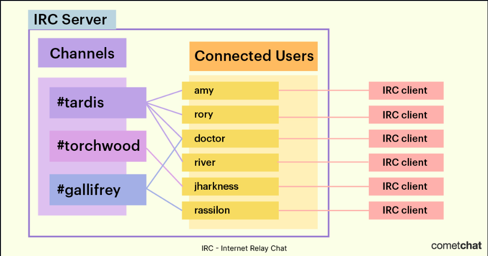

### To-do List

- [x] Socket and Multiplexing
- [x] Makefile / flags and relink
- [ ] RFC 1459 (protocols)
- [x] Authentication.
- [x] Nickname, a username.
- [x] Join a channel.
- [x] Send and receive private messages using your reference client.
- [x] All the messages sent from one client to a channel have to be forwarded to every other client that joined the channel.
- [ ] Operators and regular users.
- [ ] Signal. ^D & ^Z
- [ ] fcntl.
- [ ] Leaks. & seg correction
- [ ] Everyone's last word for this project.
- [ ] DIFI hanmen key exchangge. (let's look into that.) <--
- [ ] flood <--
- [ ] Notice, ping, pong
- [x] Kick, Topic, Part
- [x] File transfer lessgo
-----------------------------------------

-----------------------------------------

# Developers
- Emircan
- Talha
- Emre
- Sarp
- Alp

### The groups will be divided whilst examination.
-----------------------------------------

# NOTES
# Main Objective: finishing this project before 
##  1/11/2023
  ### Start of the project.
    Multiplexing handled using select. Uncharted territory in our school, 
    we are the only group that uses SELECT() for ft_IRC project.
    Transmiting of messages works.
    We are using Hexchat for reference.
    We need to chose which commands we need to implement for our project. For now we have beta PASS PRIVMSG INFO.
    5/5 day as a team. 
-----------------------------------------
##  2/11/2023
  ### Second day.
    Password check is near perfect. We are stress testing it.
    Colors added.
    Establishing modularity using a map for all commands.
    Our brain melted ...
    2/5 day because rain. frustrated kinda day.
-----------------------------------------
##  3/11/2023
  ### Third day.
    Ascii art added (Emre).
    Modularity added (Emircan).
    Kick started chanels (˚5) (Talha).
    /PASS changed to PASS in nc.
    We need to understand how to use signal ^D to send a message immediatly from nc.
    Well played boys.
-----------------------------------------
## 4/11/2023
  ### Fourth day.
    Made slight changes to the github repo.
    Nick and User added (Need to do slight changes to User to get the information in the right way).
    Channel class was updated, 1 user cannot join the same channel 2 times.
    Major step in hexchat we were able to create a channel. Number 5 indeed.
    ^D signal works.
    great day.
    Congrats indeed. Wp team.
-----------------------------------------
## 5/11/2023
  ### Fifth day.
    Vacational and busy day for all of us. We worked really good so far.
-----------------------------------------
## 6/11/2023
  ### sixth day.
    What a good day, the purpose of this day was to create a channel that we could chat on.
    We were able to do more than that.
    We recreated the function TOPIC and INVITE today.
    We eased on Authentication it works really good.
    Divided the socket and the server files because Server::Run() was getting overwhelming.
    We added a CAP file to understand which client was being used HEX or nc.
    Funny enough whilst connecting hexchat sended CAP LS, PASS, NICK and USER piece by piece always in this order.
    Every now and then it sends CAP LS than PASS ... algather. or CAP LS and PASS than the rest ex. 
    For that reason we recreated a buffer system which gets them line by line.
    In general this was probably the day that we worked the best.
-----------------------------------------
## 7/11/2023
  ### seventh day.
    We did Topic, Notice, Part.
    We elaborated on Nick and now Topic can be changed for everybody.
    We did ^D signal.
    We now see the nickname in the left side of the chanel we can send private messages.
    !!!! We can transfer filess babay.
    We can exit the chanel and now it doesn't say that we are in the chanel we fr get kicked now.
    This must be the most productive day yet.
    
-----------------------------------------
## 8/11/2023
  ### eight'st day.

    Overall good day,
    we were able to improve the gui, we did quit and semi whois.
    We can see people and change nicknames.
    We got some errors during the day.
    We did ping and pong. 
    We need to do more unit testing however we only need to do the bot, 
    the mode command for the channel,
    better the gui and add an operator than we are done with this project.
    I am proud of my team.
    
-----------------------------------------
## 9/11/2023
  ### ninth day.
    hexchat ve nc ayrimi yapip ona gore bir mesaj gonderelim.
    Parslandiginda cmd1 null olmamali.
    Kendi exeptionumuzu yazmak daha cool olur boylelikle ozellestirebiliriz.
    WHO
    OPERATORS and chanel mods
    Sagda ad cikarma. her yerde olucak ve biri ciktiginda girdiginde ve ad degistirdiginde calisacek.
    Fcntl
    Bot yazilimi (en basitinden).
    PRIVMSG'nin else if kismina bakalim
    
-----------------------------------------